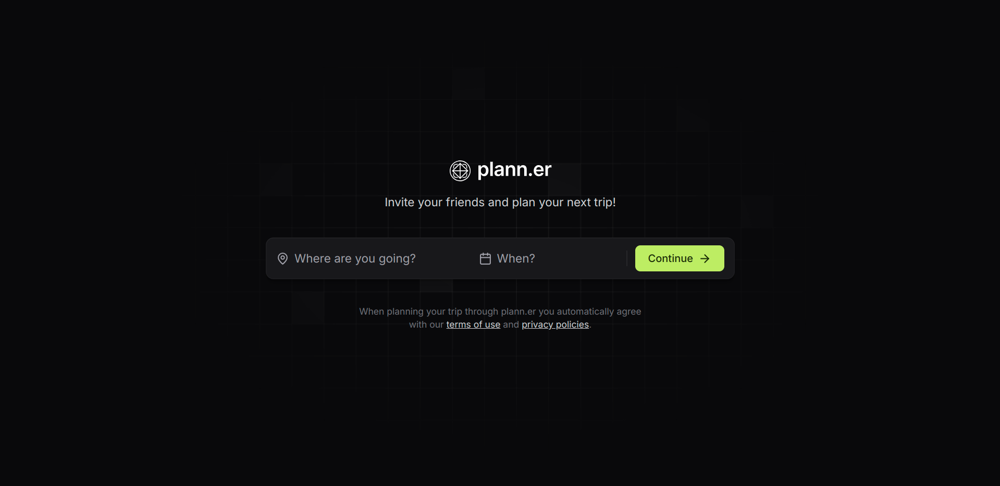
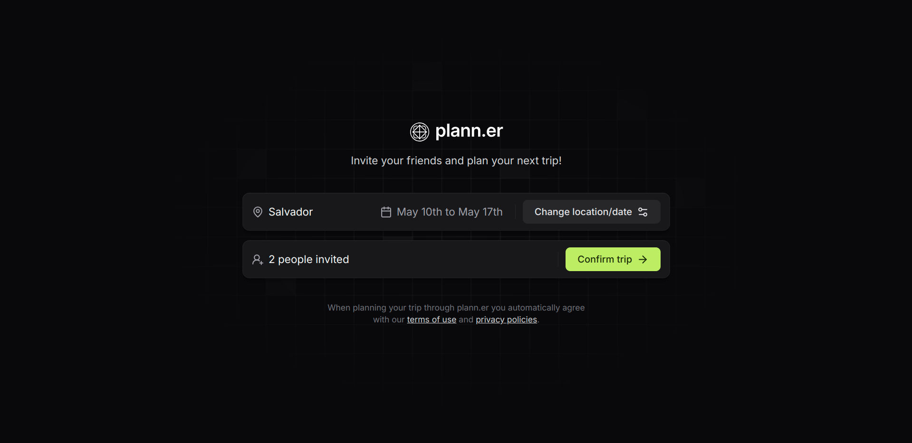
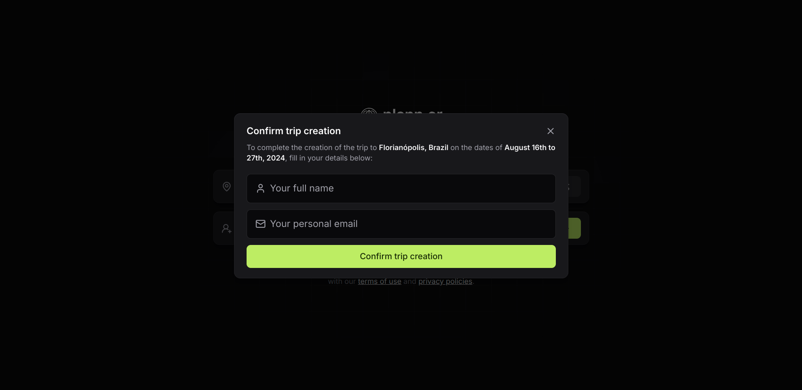
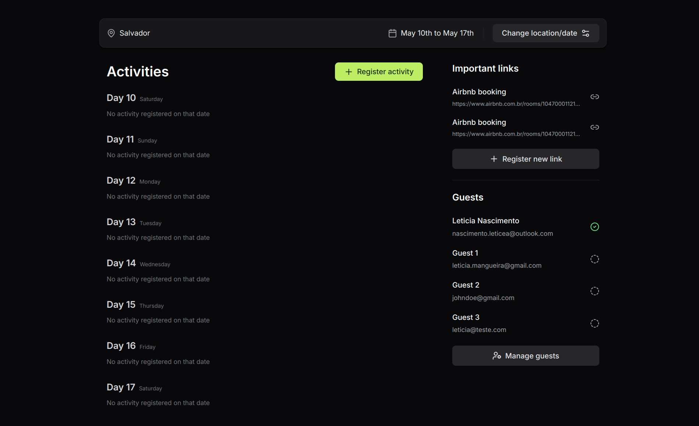
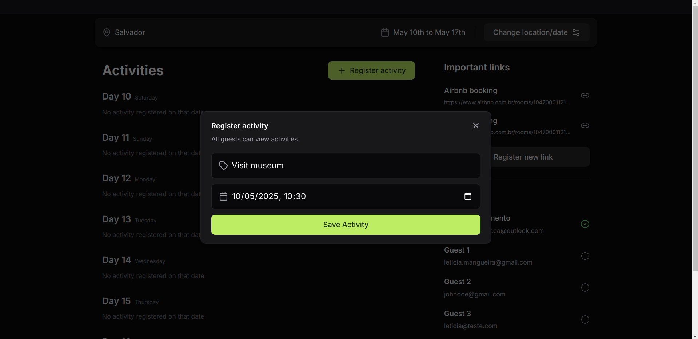
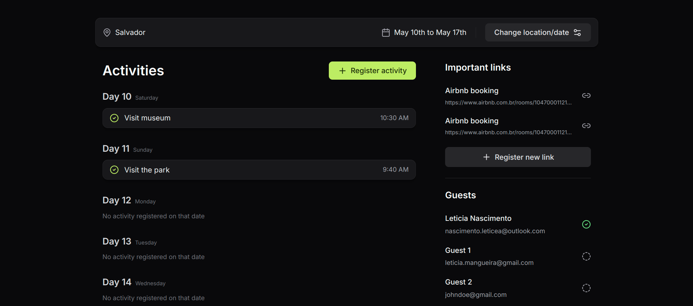

  <a href="#-technologies">Technologies</a>&nbsp;&nbsp;&nbsp;|&nbsp;&nbsp;&nbsp;
  <a href="#-project">Project</a>&nbsp;&nbsp;&nbsp;|&nbsp;&nbsp;&nbsp;
  <a href="#-how-to-run">How to run</a>&nbsp;&nbsp;&nbsp;|&nbsp;&nbsp;&nbsp;
  <a href="#-how-to-contribute">How to contribute</a>&nbsp;&nbsp;&nbsp;

 

# NLW Journey

## 🚀 Technologies

This project was developed with the following technologies:

- [Node.js](https://nodejs.org/en/) - v22.4.0
- [Npm](https://www.npmjs.com/) - 10.8.1
- [Axios](https://www.npmjs.com/package/axios) - ^1.8.4
- [Vite](https://vitejs.dev/guide/) - ^5.3.1
- [TypeScript](https://www.typescriptlang.org/) - ^5.2.2
- [Tailwindcss](https://tailwindcss.com/) - ^3.4.4
- [Tailwind Variants](https://www.tailwind-variants.org/) - ^0.2.1
- [React-router-dom](https://reactrouter.com/) - ^6.26.1
- [React DayPicker](https://daypicker.dev/) - ^9.1.4
- [Lucide React](https://lucide.dev/guide/packages/lucide-react) - ^0.408.0
- [Date-fns](https://date-fns.org/) - ^4.1.0

## 💻 Project

plann.er is an application for travel planning and management developed with Vite and TypeScript.

The tool allows the organizer to register the trip, invite all the people who will be part of the trip, and also send a trip confirmation by email, details of the trip, the activities that will take place on each day and time, the list of guests and the list of links.

NLW event on the [Rocketseat](https://www.rocketseat.com.br/) platform.

- [Back-end - API](https://github.com/leticea/nlw-journey-nodejs)

  

  

  

  

  

  

## ⚙️ How to run

- Clone the project.
- Go to the project folder and run 'npm install' (use 'yarn install' if that's your configuration).
- npm run dev to run the project on the indicated port.

## 🤔 How to contribute

- Fork this repository;
- Create a branch with your feature: `git checkout -b my-feature`;
- Commit your changes: `git commit -m 'feat: My new feature'`;
- Push to your branch: `git push origin my-feature`.

After your pull request is merged, you can delete your branch.

## 📝 License

This project is under the MIT license.
